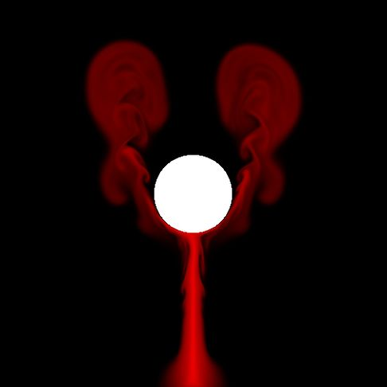

# 2D-Fluid-Simulation

This a port of the GPU GEMS article on fluid simulation to Unity. Well kinda. Its is mostly based on a 2D fluid sim found on the [Little Grasshopper blog](http://prideout.net/blog/). That project was based on the GPU GEMS article also. I found he had simplified the code a little and his way of doing things was much easier to read.

There are a lot of stages to perform per frame and getting these to all work in the right order was a little bit of a pain. I was quite surprised by how many graphics blit operations need to be performed each frame. There needs to be about 60 per frame. This is a huge amount of work for the GPU to do but the frame rate is still about 60 fps which is not bad. You can decrease the number of jacobi iterations which take up the majority of the work that needs to be done. The quality of the fluid simulation will suffer if it is decreased too much as they are needed to compute a divergent free fluid simulation.

List of physics projects

[Position-Based-Dynamics](https://github.com/Scrawk/Position-Based-Dynamics)\
[PBD-Fluid-in-Unity](https://github.com/Scrawk/PBD-Fluid-in-Unity)\
[GPU-GEMS-NBody-Simulation](https://github.com/Scrawk/GPU-GEMS-NBody-Simulation)\
[GPU-GEMS-2D-Fluid-Simulation](https://github.com/Scrawk/GPU-GEMS-2D-Fluid-Simulation)\
[GPU-GEMS-3D-Fluid-Simulation](https://github.com/Scrawk/GPU-GEMS-3D-Fluid-Simulation)\
[CyclonePhysicsEngine](https://github.com/Scrawk/CyclonePhysicsEngine)\
[2D-Deformable-body-in-Unity](https://github.com/Scrawk/2D-Deformable-body-in-Unity)
